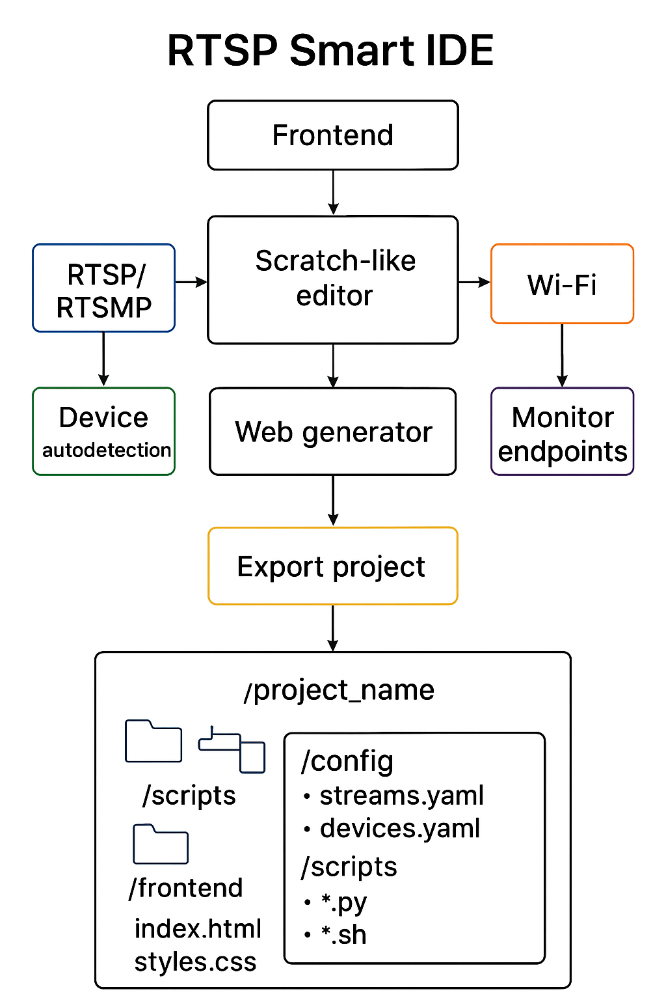

# **RTSP Smart IDE – Dokumentacja Projektu**



## **1. Cel projektu**

RTSP Smart IDE to przeglądarkowe środowisko typu low-code/no-code, które umożliwia:

* Elastyczne zarządzanie strumieniami RTSP/RTSMP.
* Autodetekcję urządzeń w sieci (kamery, RPi, inne endpointy).
* Integrację z lokalnymi skryptami Bash/Python i API/OpenAPI.
* Automatyzację akcji w odpowiedzi na statusy endpointów, dostępność sieci Wi-Fi lub urządzeń.
* Tworzenie logiki w formie Scratch-like bloków.
* Generowanie front-endu WWW jako wizualizacji projektów.
* Eksport całego projektu jako paczki ZIP gotowej do deploymentu.

---

## **2. Moduły systemu**

### **2.1 Moduł autodetekcji urządzeń**

* Skanowanie LAN w poszukiwaniu urządzeń:

  * Kamery IP (RTSP/RTSMP)
  * Raspberry Pi
  * Inne urządzenia z możliwością wykrycia przez ping, SSDP, Zeroconf
* Pobieranie metadanych: IP, typ urządzenia, dostępne strumienie.
* Statusy urządzeń i endpointów (online/offline).

### **2.2 Moduł autodetekcji Wi-Fi**

* Skanowanie dostępnych sieci Wi-Fi.
* Pobieranie danych: SSID, siła sygnału, typ zabezpieczeń.
* Statusy: dostępna/niedostępna, połączona/rozłączona.
* Możliwość automatycznego połączenia i reakcji na zmianę statusu.

### **2.3 Moduł RTSP/RTSMP**

* Obsługa wielu protokołów strumieniowania.
* Dynamiczne dodawanie i usuwanie strumieni.
* Obsługa autoryzacji i reconnection.

### **2.4 Moduł monitoringu endpointów**

* Monitorowanie API, OpenAPI, serwisów, domen.
* Definicja reguł reakcji na statusy endpointów.
* Alerty i automatyczne akcje (uruchomienie strumienia, skryptu, powiadomienie).

### **2.5 Scratch-like edytor logiki**

* Edycja logiki w formie bloków:

  * Wywołanie endpointu
  * Warunki (status HTTP, brak odpowiedzi, dostępność Wi-Fi)
  * Akcje (uruchomienie skryptu, włączenie RTSP, alerty)
* Podpinanie funkcji Python/Bash jako bloki funkcji.

### **2.6 Moduł generowania WWW**

* Generator stron dla projektów z podglądem strumieni i statusów.
* Integracja z logiką Scratch do dynamicznych widoków.
* Frontend: React + Tailwind + Blockly/Scratch.

### **2.7 Moduł eksportu projektu**

* Eksport całego projektu jako paczki ZIP z pełną strukturą:

```
/project_name
    /config
        streams.yaml
        devices.yaml
    /scripts
        *.py
        *.sh
    /frontend
        index.html
        styles.css
        scripts.js
    README.md
```

* Możliwość łatwego uruchomienia projektu na nowej maszynie.

---

## **3. Technologie**

* Backend: Python (FastAPI) + Celery dla harmonogramów.
* Frontend: React + Blockly/Scratch + Tailwind CSS.
* Streaming: OpenCV, GStreamer, FFmpeg.
* Monitoring: HTTPX/Requests + ping + netcat.
* Autodetekcja: Nmap / Zeroconf / SSDP.
* Eksport: Python `zipfile`.

---

## **4. Lista TODO**

### **Faza 1: Podstawowa infrastruktura**

1. Utworzyć szkielet backendu (FastAPI).
2. API dla konfiguracji YAML (CRUD strumieni, urządzeń, Wi-Fi).
3. Implementacja prostego monitoringu endpointów.
4. Moduł eksportu projektu do ZIP.

### **Faza 2: RTSP/RTSMP i autodetekcja urządzeń**

5. Obsługa RTSP/RTSMP strumieni w backendzie.
6. Autodetekcja urządzeń w sieci LAN (kamery, RPi).
7. Pobieranie metadanych urządzeń i zapis w YAML.

### **Faza 2b: Autodetekcja Wi-Fi**

8. Skanowanie dostępnych sieci Wi-Fi w systemie.
9. Pobieranie metadanych sieci (SSID, RSSI, typ zabezpieczeń).
10. Sprawdzanie dostępności sieci w czasie rzeczywistym.
11. Możliwość połączenia/rozłączenia z siecią przez API.

### **Faza 3: Scratch-like edytor**

12. Integracja Blockly/Scratch do edycji logiki w GUI.
13. Dodanie bloków: wywołanie endpointu, warunki, wywołanie skryptów lokalnych.
14. Połączenie logiki z statusami Wi-Fi, endpointów i urządzeń.
15. Testy scenariuszy automatyzacji.

### **Faza 3b: Bloki Wi-Fi w Scratch**

16. Dodanie bloków logiki dla Wi-Fi (dostępna, niedostępna, połączona, rozłączona).
17. Połączenie bloków z akcjami: wywołanie endpointu, uruchomienie skryptu, włączenie strumienia.

### **Faza 4: Generator WWW**

18. Prosty generator stron dla projektów (podgląd RTSP + statusy).
19. Połączenie bloków logiki z elementami frontendowymi.

### **Faza 5: Testy i eksport**

20. Testowanie automatycznego dodawania strumieni i endpointów.
21. Testowanie integracji Bash/Python jako bloków funkcji.
22. Pełne testy eksportu paczki ZIP.

### **Faza 6: Rozszerzenia i udoskonalenia**

23. Obsługa dodatkowych protokołów (RTMP, WebRTC).
24. Alerty i powiadomienia w czasie rzeczywistym (email/Telegram).
25. Udoskonalenia UI/UX edytora Scratch + generatora [WWW](http://WWW).
26. Integracja harmonogramów automatyzacji (cron/Celery).


---

## **5. Szybki start (Quickstart)**

Poniżej minimalny szkielet projektu zgodny z założeniami. Backend (FastAPI) zapewnia CRUD na YAML, proste monitorowanie i eksport do ZIP. Frontend to lekka strona (Tailwind CDN + JS), która wywołuje API.

### **5.1 Wymagania**

* Python 3.10+
* Dostęp do internetu (instalacja zależności)

### **5.2 Instalacja i uruchomienie**

1. Zainstaluj zależności i utwórz wirtualne środowisko:

```
make setup
```

2. Uruchom backend (FastAPI na porcie 8000):

```
make run-backend
```

3. W osobnej konsoli uruchom prosty serwer frontendu (port 5173):

```
make run-frontend
```

4. Otwórz w przeglądarce:

```
http://localhost:5173
```

Frontend komunikuje się domyślnie z `http://localhost:8000`.

### **5.3 Struktura wygenerowana**

```
/backend
  main.py                # FastAPI: API, monitoring, eksport ZIP
  requirements.txt       # Zależności backendu
/config
  streams.yaml           # Konfiguracja strumieni
  devices.yaml           # Wykryte/zarządzane urządzenia
  wifi.yaml              # Sieci Wi‑Fi (przykłady)
/frontend
  index.html             # Minimalny dashboard
  scripts.js             # Wywołania API (health, streams, ping, export)
  styles.css             # (opcjonalny) CSS uzupełniający
/scripts
  sample.sh              # Przykładowy skrypt Bash
  sample.py              # Przykładowy skrypt Python
Makefile                 # Cele: setup, run-backend, run-frontend
exports/                 # (ignorowany w git) paczki ZIP z eksportu
```

### **5.4 API (wybrane endpointy)**

* `GET /api/health` – status usługi.
* `GET /api/streams` – lista strumieni (z `streams.yaml`).
* `POST /api/streams` – utworzenie strumienia.
* `PUT /api/streams/{id}` – edycja strumienia.
* `DELETE /api/streams/{id}` – usunięcie strumienia.
* `GET /api/devices` – lista urządzeń (z `devices.yaml`).
* `GET /api/monitor/ping?host=8.8.8.8` – prosty ping.
* `GET /api/monitor/http?url=https://example.com` – sprawdzenie HTTP.
* `POST /api/export` – eksport całego projektu do ZIP (do folderu `exports/`).

Uwaga: akcje RTSP (start/stop) są placeholderami do dalszej implementacji (FFmpeg/GStreamer).

### **5.5 Następne kroki**

* Implementacja obsługi RTSP/RTSMP (FFmpeg/GStreamer) oraz reconnection.
* Autodetekcja urządzeń (Nmap/Zeroconf/SSDP) i zapis do YAML.
* Integracja Blockly/Scratch w froncie i mapowanie bloków na akcje API/skrypty.
* Rozbudowa generatora WWW podglądów i statusów.
